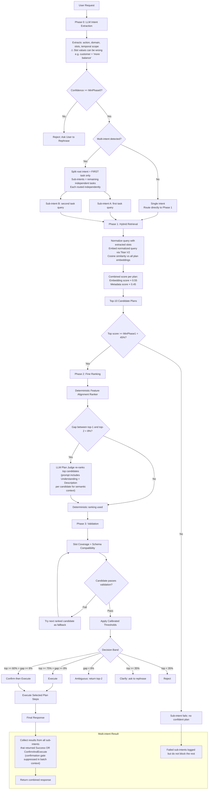

# LLM Pipeline Request Flow

Use this as a quick reference for what happens when the LLM pipeline is active.

## Diagram

## Step Summary

1. **Phase 0 — LLM Intent Extraction**: parse action, domain, sub-domain, slots, and temporal scope from the raw query.
   - ⚠ Slot values can be extracted incorrectly (e.g. `customer = "more balance"` when no customer was named). The extracted slot feeds into Phase 1 normalization, so a bad value can influence embedding comparison.
2. **Confidence gate**: if overall confidence is below the `MinPhase0` threshold, stop and ask the user to rephrase.
3. **Multi-intent detection**: if the LLM identifies more than one independent task:
   - The **root intent covers only the first task**; its `query` field is set to the first task's text by the LLM.
   - Each additional task becomes a separate sub-intent with its own isolated query.
   - All intents are routed **independently** through Phases 1–3.
   - Sub-intents that return `Success` **or** `ConfirmAndExecute` are both collected — the per-sub-intent confirmation gate is suppressed in batch context since Phase 3 has already passed.
4. **Phase 1 — Hybrid Retrieval** (per intent):
   - Normalize the query (replace **temporal tokens only** — fiscal years, quarters, months, years, ISO dates — with typed placeholders; entity names are left as-is).
   - Embed the normalized query with Amazon Titan V2.
   - Score every plan: `embedding cosine × 0.55 + metadata alignment × 0.45`.
   - Plan embedding text includes `Understanding`, `Description` (stripped Approach), and `SampleQueries` (all normalized at build time).
   - Return the top-10 candidates.
5. **MinPhase1 gate**: if the best candidate scores below 45 %, this intent fails routing (other intents still proceed).
6. **Phase 2 — Fine Ranking**: deterministic feature alignment scorer runs first; if the top two scores are within 8 % of each other, the LLM Plan Judge re-ranks by sending each candidate's `Understanding` and `Description` alongside its steps/slots/outputs for semantic context.
7. **Phase 3 — Validation**: slot coverage and schema compatibility are checked on the top candidate. On failure, the next ranked candidate is tried as a fallback.
8. **Calibrated decision**: the final score and gap between top-1 and top-2 determine whether to execute, confirm, request clarification, or reject.
9. **Multi-intent result**: all successfully routed intents execute and their results are joined. Failed sub-intents are logged but do not block the rest.

## Known Pitfalls

- **Wrong slot extraction**: the LLM can bind descriptive phrases to slot names (e.g. `customer = "more balance"`). System prompt rules forbid this (only proper nouns/IDs allowed as slot values; descriptive qualifiers go in `constraints`), but LLM compliance is not guaranteed.
- **Weak plan specificity**: validation only checks whether required slot keys are present (by `defaultEntities`). A plan with only `companyId` defaulted will always pass validation regardless of whether the user's real subject (e.g. balance or payments) is represented.
