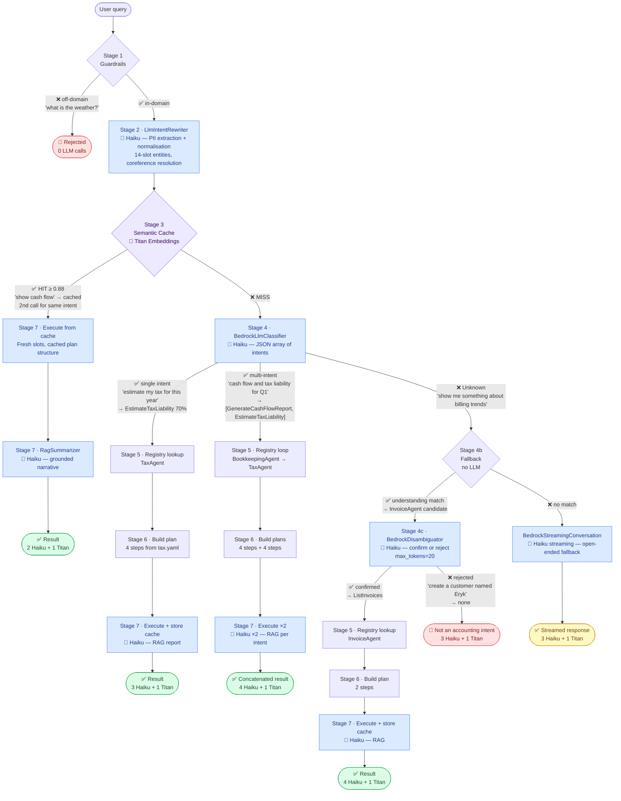

# CFF Routing Layer

An intent-driven **agent routing layer** for accounting and finance workflows, built on .NET 9 and AWS Bedrock. Natural-language queries are normalised, classified (single or multi-intent), and dispatched to the appropriate agent — each producing a structured, multi-step execution plan derived entirely from YAML. Execution steps retrieve real financial records from `CompanyDataStore` and, when enabled, generate LLM-narrated reports via a RAG loop (Retrieve → Augment → Generate). No C# change is needed to add a new intent or agent.

---

## Table of Contents

- [CFF Routing Layer](#cff-routing-layer)
  - [Table of Contents](#table-of-contents)
  - [Overview](#overview)
  - [Solution Structure](#solution-structure)
  - [Seven-Stage Routing Pipeline](#seven-stage-routing-pipeline)
    - [Stage 1 — Guardrails](#stage-1--guardrails)
    - [Stage 2 — Intent Rewriter](#stage-2--intent-rewriter)
    - [Stage 3 — Semantic Cache](#stage-3--semantic-cache)
    - [Stage 4 — Intent Classification (multi-intent)](#stage-4--intent-classification-multi-intent)
    - [Stage 4b — Fallback Matching](#stage-4b--fallback-matching)
    - [Stage 4c — LLM Disambiguation](#stage-4c--llm-disambiguation)
    - [Stage 5 — Agent Registry Lookup](#stage-5--agent-registry-lookup)
    - [Stage 6 — Execution Plan Generation](#stage-6--execution-plan-generation)
    - [Stage 7 — Execute \& Cache](#stage-7--execute--cache)
  - [Component Reference](#component-reference)
    - [Intent Rewriter](#intent-rewriter)
    - [Semantic Cache](#semantic-cache)
    - [Intent Classifier](#intent-classifier)
    - [Agent Registry](#agent-registry)
    - [Execution Plans](#execution-plans)
    - [Company Data Store](#company-data-store)
    - [RAG Summarizer](#rag-summarizer)
    - [Conversation History](#conversation-history)
  - [YAML Plan Schema](#yaml-plan-schema)
  - [Registered Agents](#registered-agents)
  - [AWS Bedrock Integration](#aws-bedrock-integration)
  - [Feature Flags](#feature-flags)
  - [Full LLM Mode](#full-llm-mode)
    - [LLM layer map](#llm-layer-map)
    - [Routing flow — example scenarios](#routing-flow--example-scenarios)
    - [Stage 2 — entity slots extracted by `LlmIntentRewriter`](#stage-2--entity-slots-extracted-by-llmintentrewriter)
    - [Stage 3 — semantic cache with Titan Embeddings V2](#stage-3--semantic-cache-with-titan-embeddings-v2)
    - [Stage 4 — LLM classifier for multi-intent](#stage-4--llm-classifier-for-multi-intent)
    - [Stage 7 — RAG report generation](#stage-7--rag-report-generation)
    - [Conversation history and compaction](#conversation-history-and-compaction)
  - [Configuration Reference](#configuration-reference)
  - [Cost Analysis](#cost-analysis)
    - [Per-call token estimates](#per-call-token-estimates)
    - [Per-call cost](#per-call-cost)
    - [Cost per routing scenario (all LLM flags enabled)](#cost-per-routing-scenario-all-llm-flags-enabled)
    - [Monthly cost projection](#monthly-cost-projection)
    - [Cost optimisation levers](#cost-optimisation-levers)
  - [Getting Started](#getting-started)
  - [Running Tests](#running-tests)
  - [Running Benchmarks](#running-benchmarks)

---

## Overview

```
User message
     │
     ▼
┌──────────────────────────────────────────────────────────────┐
│                       RoutingEngine                          │
│                                                              │
│  Stage 1   Guardrails      (domain keyword check)            │
│  Stage 2   Intent Rewriter (LLM or regex + PII extraction)   │
│  Stage 3   Semantic Cache  (cosine similarity lookup)        │
│  Stage 4   Classifier      (multi-intent: rule-based or LLM) │
│  Stage 4b  Fallback        (capability → understanding)      │
│  Stage 4c  Disambiguation  (LLM confirmation of 4b match)    │
│  Stage 5   Agent Registry  (O(1) lookup by AgentId)          │
│  Stage 6   Plan Generation (from YAML steps + merged params) │
│  Stage 7   Execution       (DAG steps → cache store)         │
│            ↳ CompanyDataStore  (financial data retrieval)    │
│            ↳ RagSummarizer     (LLM-narrated reports)        │
└──────────────────────────────────────────────────────────────┘
     │
     ▼
Structured result string  (single or concatenated multi-intent)
```

Every component has two modes controlled by environment-variable feature flags: a **local mode** (no AWS credentials needed) and a **live Bedrock mode** for production quality. The two modes are independently switchable per component.

---

## Solution Structure

```
cff-routing-layer/
├── CffRoutingLayer.sln
│
├── CffRoutingLayerDemo/                      # Main application
│   ├── Program.cs                            # Startup, REPL
│   ├── .env / .env.template                  # Runtime configuration
│   │
│   ├── Bedrock/
│   │   ├── BedrockDisambiguator.cs       # Claude Haiku Stage 4c LLM confirmation (USE_BEDROCK_DISAMBIGUATOR)
│   │   ├── BedrockEmbeddingProvider.cs       # Titan Embeddings V2 + local disk cache
│   │   ├── BedrockLlmClassifier.cs           # Claude Haiku intent classifier
│   │   ├── BedrockSemanticCache.cs           # Bedrock-backed semantic cache
│   │   ├── BedrockStreamingConversation.cs   # Streaming fallback for Unknown intents
│   │   ├── CanonicalPhrases.cs               # Intent ↔ AgentId map (loaded from plans)
│   │   ├── LlmIntentRewriter.cs              # Claude Haiku rewriter with runtime context
│   │   └── RagSummarizer.cs                  # Claude Haiku RAG report generation
│   │
│   ├── Cache/
│   │   ├── CacheEntry.cs                     # Cache record (vector, intent, plan, timestamp)
│   │   ├── CacheWarmer.cs                    # Pre-warms cache from plan sample queries
│   │   ├── EmbeddingSimulator.cs             # Local keyword-vector simulator (no AWS)
│   │   ├── ISemanticCache.cs                 # Cache interface
│   │   └── InMemorySemanticCache.cs          # In-memory cosine similarity cache
│   │
│   ├── Classification/
│   │   ├── IDisambiguator.cs                 # Disambiguation interface (Stage 4c)
│   │   ├── IIntentClassifier.cs              # Classifier interface (Classify + ClassifyAll)
│   │   └── RuleBasedClassifier.cs            # Keyword/regex classifier (no AWS)
│   │
│   ├── Config/
│   │   └── AppConfig.cs                      # Environment-variable configuration
│   │
│   ├── Conversation/
│   │   ├── ConversationHistory.cs            # Multi-turn history + LLM compaction
│   │   └── ConversationTurn.cs               # Single-turn record
│   │
│   ├── Core/
│   │   ├── ExecutionPlan.cs                  # PlanStep + ExecutionPlan records
│   │   ├── IntentResult.cs                   # Classification output record
│   │   ├── RoutingContext.cs                 # Per-request context (companyId, requestId, …)
│   │   └── RoutingEngine.cs                  # Orchestrates all 7 stages
│   │
│   ├── Demo/
│   │   ├── ConsoleRenderer.cs                # Spectre.Console UI
│   │   ├── DemoScenarios.cs                  # Loads scenarios from routing_benchmarks.yaml + rewriter_benchmarks.yaml
│   │   └── SessionStats.cs                   # Tracks latency and call counts per session
│   │
│   ├── Normalization/
│   │   ├── IntentRewriter.cs                 # IIntentRewriter + RegexIntentRewriter
│   │   └── RewrittenIntent.cs                # Rewriter output record
│   │
│   ├── CompanyData/
│   │   ├── FinancialRecord.cs                # Income/Expense record
│   │   └── CompanyDataStore.cs               # In-memory ledger (40 seeded records)
│   │
│   ├── Plans/
│   │   ├── PlanDefinition.cs                 # YAML model (PlanDefinition, YamlPlanStep, …)
│   │   ├── PlanExecutor.cs                   # Data-driven step execution + optional RAG
│   │   ├── PlanLoader.cs                     # YamlDotNet deserialization
│   │   └── PlanStepResult.cs                 # Per-step result record
│   │
│   ├── Registry/
│   │   ├── AgentManifest.cs                  # Agent metadata + plan factory
│   │   └── AgentRegistry.cs                  # Dynamic registry loaded from YAML
│   │
│   ├── benchmarks/
│   │   ├── routing_benchmarks.yaml           # 9 suites, 50 queries (source of demo scenarios)
│   │   └── rewriter_benchmarks.yaml          # 2 suites, 12 queries; normalisation + coreference cases (also loaded by demo)
│   │
│   ├── plans/                                # One YAML file per agent intent
│   │   ├── cashflow.yaml
│   │   ├── cashrunway.yaml
│   │   ├── invoice.yaml
│   │   ├── listinvoices.yaml
│   │   ├── profitaudit.yaml
│   │   ├── profitloss.yaml
│   │   ├── reconcile.yaml
│   │   ├── tax.yaml
│   │   └── taxoptimization.yaml
│   │
│   └── tests/
│       ├── cache_tests.yaml                  # Cache hit/miss test cases
│       ├── classification_tests.yaml         # Single-intent classifier test cases
│       └── multi_intent_tests.yaml           # Multi-intent classifier and routing test cases
│
├── CffRoutingLayerDemo.Tests/                # xUnit test suite (48 tests)
│   └── UnitTest1.cs
│
└── CffRoutingLayerDemo.Benchmarks/           # BenchmarkDotNet micro-benchmarks
    ├── CacheWarmerBenchmarks.cs
    ├── MultiIntentBenchmarks.cs
│   ├── RewriterBenchmarks.cs                 # Loads queries from rewriter_benchmarks.yaml; regex vs LLM comparison
    └── RoutingPipelineBenchmarks.cs
```

---

## Seven-Stage Routing Pipeline

`RoutingEngine.HandleAsync()` runs every request through these stages in order:

### Stage 1 — Guardrails

A fast `HashSet<string>` membership check against domain keywords (`cash`, `invoice`, `tax`, `reconcile`, `profit`, `runway`, `anomaly`, `deduction`, …). Messages with no domain signal are rejected immediately with a polite refusal — no Bedrock call is made.

**Bypass:** when `ConversationHistory.TotalTurns > 0` the guardrail is suppressed. Follow-up queries such as "do the same for Q2" contain no domain keywords but are valid continuations — the rewriter resolves context from history.

> **Demo isolation:** the demo runner creates a fresh `ConversationHistory` for each benchmark scenario so that guardrail behaviour is predictable and the "Guardrail rejection" suite always rejects off-domain queries regardless of preceding turns.

### Stage 2 — Intent Rewriter

Normalises the raw user message before any further processing:

| Mode | Component | Behaviour |
|------|-----------|-----------|
| Local | `RegexIntentRewriter` | Regex substitutions: currency spellings, date aliases, synonym normalisation (bill → invoice, recon → reconcile, p&l → profit and loss) |
| Live  | `LlmIntentRewriter` | Claude Haiku with two `SystemContentBlock`s: static rewriting rules + dynamic runtime context (current date, month, fiscal quarter, YTD start) |

In both modes the rewriter extracts named entities: `accountId`, `amount`, `quarter`, `month`, `year`, `entityType`, and `customer` (after for/to/from/by). These entities flow through every subsequent stage and are merged into plan step parameters at execution time.

Output: `RewrittenIntent { NormalizedText, ExtractedEntities, Capabilities }`.

### Stage 3 — Semantic Cache

Cosine-similarity lookup on the **normalised text** (never the raw input):

| Mode | Component | Threshold |
|------|-----------|-----------|
| Local | `InMemorySemanticCache` + `EmbeddingSimulator` | 0.75 |
| Live  | `BedrockSemanticCache` + `BedrockEmbeddingProvider` | 0.88 |

A **cache HIT** skips Stages 4–6 entirely and jumps straight to Stage 7 plan execution, reusing the cached `IntentResult` and `ExecutionPlan` **structure**.

> **Slot refresh on cache hit:** the cached plan describes *which steps to run and in what order*. It does **not** carry the previous query's entity values. On every cache hit the plan is re-executed with the current query's freshly-extracted entities (`RewrittenIntent.ExtractedEntities`), so `customer`, `unitPrice`, `dueDate`, and all other slots always reflect the new request — never the query that originally populated the cache.

The cache is **pre-warmed at startup**: `CacheWarmer` iterates each plan's `sampleQueries`, embeds them, and stores entries. This guarantees a hit rate > 0 from the very first query that matches a sample phrase.

`EmbeddingSimulator` uses a fixed set of keyword dimensions (`cashflow`, `cash`, `flow`, `invoice`, `bill`, `customer`, `reconcile`, `tax`, `profit`, `loss`, `runway`, …) and computes cosine similarity on term-frequency vectors — no AWS dependency, deterministic, sub-millisecond.

`BedrockEmbeddingProvider` maintains a **local disk cache** (`embeddings_cache.json`) so Titan Embeddings calls are never repeated for the same text across restarts.

### Stage 4 — Intent Classification (multi-intent)

Calls `IIntentClassifier.ClassifyAll(normalizedText)` which returns **all** intents that score above the threshold, ordered by descending confidence. This enables multi-intent routing from a single query.

| Mode | Component | Notes |
|------|-----------|-------|
| Local | `RuleBasedClassifier.ClassifyAll` | Evaluates every declared intent rule; returns all matches above threshold |
| Live  | `BedrockLlmClassifier.ClassifyAll` | Claude Haiku returns a JSON array of intent objects; all items are returned |

`CanonicalPhrases.Intents` and `IntentToAgent` are loaded dynamically from the YAML plan files at startup — the classifier always reflects the current registered agent set.

**Multi-intent execution:** when `knownIntents.Count > 1`, Stages 5–7 run in a loop, once per intent. Each partial result is prefixed with its intent label and the final response concatenates all results.

```
► Stage 4   Intent classification...   ✓ 3 intents: GenerateCashFlowReport, EstimateTaxLiability, GenerateProfitLoss
► Stage 5   Agent registry lookup...   ✓ BookkeepingAgent (GenerateCashFlowReport)
► Stage 7   Executing plan [1/3]...
► Stage 5   Agent registry lookup...   ✓ TaxAgent (EstimateTaxLiability)
► Stage 7   Executing plan [2/3]...
► Stage 5   Agent registry lookup...   ✓ ReportingAgent (GenerateProfitLoss)
► Stage 7   Executing plan [3/3]...
```

### Stage 4b — Fallback Matching

When Stage 4 returns only `Unknown`, two fallback strategies are tried in order:

**1. Capability-based matching** (`AgentRegistry.FindByCapability`): scans each manifest's `Capabilities` array. A capability matches if the full hyphenated phrase or any individual word (> 3 chars) within it appears in the normalised text. Returns the first match above a 0.7 ratio threshold.

**2. Understanding-based matching** (`AgentRegistry.FindByUnderstanding`): for each agent, tokenises its `understanding` field (the natural-language plan description), computes the fraction of meaningful tokens (> 3 chars) found in the query, adds a bonus for expected output field names (`TotalIncome`, `NetFlow`, …), and selects the highest-scoring agent above threshold 0.25. This catches queries that use neither domain keywords nor capability phrases but still describe a supported task naturally.

```
► Stage 4   Intent classification...   ✗ Unknown (0%)
► Stage 4b  Understanding match...     ✓ BookkeepingAgent — [Generate a cash flow report showing money…]
```

If both fallbacks fail, a "could not determine" response is returned with no Bedrock call.

### Stage 4c — LLM Disambiguation

When Stage 4b produces exactly one fallback candidate and `USE_BEDROCK_DISAMBIGUATOR=true`, the engine passes the query and the candidate's `Understanding` text to `BedrockDisambiguator` for LLM-level confirmation before routing.

```
► Stage 4   Intent classification...   ✗ Unknown (0%)
► Stage 4b  Fallback match...          ✓ InvoiceAgent — understanding match [Create and send an invoice…]
► Stage 4c  Disambiguation...          ✗ REJECTED — not an accounting intent (310 ms)
```

`BedrockDisambiguator` sends the user query and a numbered candidate list (intent name + Understanding description) to Claude Haiku (`max_tokens=20`, `temperature=0`) with a system prompt that instructs the model to reply with *only* the exact intent name or the single word `none`.

**Rejection policy:** if the LLM returns `none`, the response is an unrecognised-intent message. On any error (network failure, null response, unexpected output), `SelectAsync` returns `null` — rejecting all candidates. A false-positive route (e.g. routing "create a customer" to `CreateInvoice`) is more harmful than a conservative rejection.

**Guarded by `fromFallback` flag:** Stage 4c only fires when Stage 4b was the source of the candidate list, never on a direct Stage 4 classifier result, so the extra LLM call is incurred only for genuinely ambiguous fallback cases.

### Stage 5 — Agent Registry Lookup

`AgentRegistry.Resolve(agentId)` is an O(1) dictionary lookup by `AgentId`, returning the matching `AgentManifest`. Multiple manifests can share the same `AgentId` (e.g. `InvoiceAgent` serves both `CreateInvoice` and `ListInvoices`) — the manifest whose `Intent` matches the classified intent is selected.

### Stage 6 — Execution Plan Generation

`AgentManifest.BuildPlan(intent, context)` calls the plan factory captured from the YAML file.

**Parameter merging (highest → lowest precedence):**
1. YAML `parameters` on the individual step
2. Classifier-extracted entities
3. Rewriter-extracted entities (merged with classifier — classifier wins on conflict)
4. `defaultEntities` declared in the plan file
5. `companyId` from `RoutingContext`

**Step dependency resolution:** the registry pre-computes `DependsOn` arrays. Both the legacy `dependsOn: [1, 2]` list and the canonical `nextStep:` chaining are supported and normalised to the same DAG representation at load time.

Output: `ExecutionPlan { PlanId, Intent, Steps[] }`.

### Stage 7 — Execute & Cache

`PlanExecutor.ExecuteAsync()` runs steps in topological order (respecting `DependsOn`). After all steps complete the result is stored in the semantic cache and appended to `ConversationHistory`.

**Data retrieval:** `CompanyDataStore.GetTransactions(companyId, period)` pre-fetches all matching financial records and makes them available to every step via `ExecutionData { Records, CurrentBalance, Period, CompanyId }`. Computed values (net flow, burn rate, tax liability, runway months) are derived from real seeded records, not stub strings.

**RAG generation (optional):** report steps detect a live `RagSummarizer` and, when present, pass the retrieved records as context to Claude Haiku, which produces a grounded financial narrative. When `USE_BEDROCK_RAG=false`, a local formatter runs with no Bedrock call.

> **Cache hit execution:** when Stage 3 returns a hit, Stage 7 still runs a full execution pass — it does **not** return the previous query's result string. The cached object carries only the plan structure (step list, actions, YAML parameters); all slot values (`customer`, `amount`, `unitPrice`, `dueDate`, …) come from the current query's rewritten entities. Two structurally identical queries with different slot values (e.g. invoices for different customers at different prices) therefore always produce different outputs.

---

## Component Reference

### Intent Rewriter

**Local** (`RegexIntentRewriter`, < 1 ms):
- Surface normalisation: `bill` → `invoice`, `recon` → `reconcile`, `p&l` → `profit and loss` (the phrase `profit anomaly` is explicitly excluded from this rule)
- Date aliases: `last month`, `this quarter`, `ytd`, `last 30 days`
- Currency normalisation: `five hundred dollars` → `$500`

**Live** (`LlmIntentRewriter`): two `SystemContentBlock`s per Claude Haiku request:
1. *Static rules* — PII extraction schema, output format constraints, synonym table
2. *Dynamic runtime context* — current date, month name, prior month, fiscal quarter (Q1–Q4), prior quarter, fiscal year, YTD start date, day of week

The runtime context lets the LLM resolve relative references (`"last quarter"`, `"this fiscal year"`) against the actual calendar at request time.

### Semantic Cache

`ISemanticCache` interface — both implementations share:

```csharp
CacheEntry? Lookup(string normalizedText);
void Store(string normalizedText, IntentResult intent, ExecutionPlan plan);
```

`InMemorySemanticCache` stores `CacheEntry { Vector, Intent, Plan, Timestamp }` and computes cosine similarity using `EmbeddingSimulator` vectors.

`BedrockSemanticCache` uses 1536-dimensional Titan Embeddings V2 vectors. Both implementations store the **normalised** (PII-stripped) text as the cache key, so `"Reconcile account CHK-001 for May"` and `"Reconcile account SAV-9901 for April"` share the same embedding neighbourhood via their `reconcile` dimension component.

### Intent Classifier

`IIntentClassifier` exposes two methods:

```csharp
IntentResult Classify(string userMessage);
IReadOnlyList<IntentResult> ClassifyAll(string userMessage);
```

`RuleBasedClassifier` evaluates every declared intent rule. Scoring is by keyword-ratio: fraction of rule keywords found in the message. A negative-phrase filter prevents false positives (e.g. `"p&l"` in a reconciliation context does not trigger `GenerateProfitLoss`). `ClassifyAll` returns all intents above the confidence threshold.

`BedrockLlmClassifier` includes the full `CanonicalPhrases.Intents` list and `IntentToAgent` map in its system prompt. The response is parsed from a JSON array, enabling true multi-intent classification in a single LLM call.

### Agent Registry

`AgentRegistry` is a `Dictionary<string, List<AgentManifest>>` keyed by `AgentId`.

**`LoadFromPlans(directory)`** (runtime path) — reads all `*.yaml` plan files and constructs one `AgentManifest` per plan. Each manifest stores:
- `AgentId`, `DisplayName`, `Description`, `Intent`, `Capabilities[]`
- `Understanding` — natural-language plan description used by Understanding-based fallback
- `ExpectedSummaryFields[]` — output field names used as a scoring bonus in Understanding matching
- `PlanFactory` — closure that builds an `ExecutionPlan` from the captured `PlanDefinition`

**`FindByCapability(text, extractedCapabilities)`** — checks capability keywords against the normalised text; returns the highest-matching manifest above a 0.7 ratio threshold.

**`FindByUnderstanding(text)`** — tokenises each agent's `Understanding` field; scores by meaningful-token overlap with the query plus a PascalCase-field bonus; returns the best match above threshold 0.25.

**`BuildDefault()`** — lightweight registry used by unit tests; manifests return a generic 3-step plan (authenticate → execute → generate-report).

### Execution Plans

```csharp
record PlanStep(int StepId, string Action, Dictionary<string,string> Input, int[] DependsOn);
record ExecutionPlan(string PlanId, string Intent, List<PlanStep> Steps);
```

Steps form a DAG. `PlanExecutor` resolves topological order via `DependsOn` and runs steps sequentially. Each step's `Input` dictionary contains the full merged context: company ID, extracted PII entities, and YAML-declared static parameters.

`PlanStepResult` records the outcome of each step: `{ StepId, Action, Output, Success, ElapsedMs }`.

### Company Data Store

`CompanyDataStore` is an in-memory ledger seeded with 40 `FinancialRecord` objects for company `DEMO-001` spanning January–May 2026:

| Category | Count | Notes |
|----------|-------|-------|
| Income — Consulting | 5 | TechVentures LLC, ~$5 K/month |
| Income — Licenses | 5 | GlobalCorp, Acme, RetailCo, StartupCo |
| Expense — Payroll | 5 | ~$18 K/month |
| Expense — Rent | 5 | $3.5 K/month |
| Expense — AWS | 5 | ~$1.1 K/month |
| Expense — Other | 15 | Marketing, Travel, Insurance, Equipment, Microsoft 365 |

Key aggregate facts embedded in the seed data:
- May net flow: **+$4,390** (best month)
- April net flow: **−$6,890** (equipment purchase)
- Q1 2026 net flow: **−$25,460** (ramp-up quarter)
- Current balance: **$142,500**

`GetTransactions(companyId, period)` resolves natural-language periods: `"last month"`, `"this month"`, `"last 30 days"`, `"last 6 months"`, `"Q1 2026"`, `"March"`, `"FY2024"`, bare years.

### RAG Summarizer

`RagSummarizer` closes the Retrieve → Augment → Generate loop. It serialises the pre-fetched `FinancialRecord` list as the data context and calls Claude Haiku:

| Method | Prompt focus |
|--------|-------------|
| `SummarizeCashFlowAsync` | Net flow, top inflows/outflows, period trend |
| `SummarizeProfitLossAsync` | Revenue, COGS estimate, gross margin, net income |
| `SummarizeRunwayAsync` | Monthly burn rate, runway months from current balance |

Settings: `MaxTokens = 400`, `Temperature = 0.3f`. System prompt instructs Claude to behave as a concise financial analyst using specific dollar amounts with no markdown headers.

Enabled by `USE_BEDROCK_RAG=true`. Falls back transparently to local formatters when disabled.

### Conversation History

`ConversationHistory` holds an ordered list of `ConversationTurn` records. Each turn stores the user message, normalised message, extracted entities, intent, agent ID, assistant response, and timestamp.

The rewriter receives the last `RewriterContextTurns` turns (default 4) as a context string for coreference resolution.

When `TotalTurns >= CompactionThreshold` (15), `CompactAsync()` summarises the oldest turns via Claude Haiku and replaces them with a 2–3 sentence summary, keeping the active window at `MaxActiveTurns` (8) turns.

---

## YAML Plan Schema

Each file in `plans/` describes one agent and its execution steps. Fields consumed by the routing engine:

```yaml
planId: cashflow-001              # unique plan identifier
intent: GenerateCashFlowReport    # intent string matched by the classifier
agentId: BookkeepingAgent         # AgentId key in the registry
displayName: Bookkeeping Agent    # human-readable label
description: "..."

capabilities:                     # keyword tags for capability-based fallback routing
  - cash-flow
  - bookkeeping

understanding: "Generate a cash flow report showing money received and spent for a given period"
  # Natural-language description — used by Understanding-based fallback matching.
  # Tokens from this text are scored against the incoming query.

expectedData:
  summary:                        # output field names — PascalCase components used as
    - TotalIncome                 # a scoring bonus in Understanding matching
    - TotalExpense
    - NetFlow
    - Period
    - CompanyId

defaultEntities:                  # injected into every step as base runtime parameters
  companyId: DEMO-001
  period: last month

sampleQueries:                    # used to pre-warm the semantic cache at startup
  - "Generate a cash flow report for last month"
  - "What's the cash position for this quarter?"

steps:                            # DAG of execution steps
  - id: 1
    action: fetch-transactions
    dependsOn: []                 # no dependencies — runs first

  - id: 2
    action: classify-transactions
    dependsOn: [1]
    parameters:
      ledgerType: operating       # static override (highest parameter precedence)

  - id: 3
    action: compute-net-flow
    dependsOn: [2]

  - id: 4
    action: generate-cash-flow-report
    dependsOn: [3]
```

**Canonical step format** (Tool/Code steps) is also supported. Canonical steps use `stepType`, `toolName`, `input` (key-value list), and `nextStep` (linear chain). The registry normalises both formats to the same `PlanStep` DAG at load time.

**Parameter precedence (highest → lowest):**
1. YAML `parameters` on the step
2. Classifier-extracted entities
3. Rewriter-extracted entities
4. `defaultEntities` from the plan file
5. `companyId` from `RoutingContext`

---

## Registered Agents

| Agent ID | Intent | Capabilities | Plan Steps |
|----------|--------|--------------|------------|
| `BookkeepingAgent` | `GenerateCashFlowReport` | cash-flow, bookkeeping | fetch-transactions → classify-transactions → compute-net-flow → generate-cash-flow-report |
| `InvoiceAgent` | `CreateInvoice` | invoicing, billing | validate-customer → create-invoice-record → apply-tax → send-invoice |
| `InvoiceAgent` | `ListInvoices` | invoicing, billing | fetch-invoices → render-invoice-list |
| `ReconciliationAgent` | `ReconcileAccount` | reconciliation, bookkeeping | fetch-bank-statement → fetch-ledger-entries → match-transactions → flag-discrepancies → generate-reconciliation-report |
| `TaxAgent` | `EstimateTaxLiability` | tax, compliance | fetch-taxable-income → apply-deductions → compute-tax-liability → generate-tax-estimate-report |
| `ReportingAgent` | `GenerateProfitLoss` | profit-loss, reporting | fetch-revenue → fetch-expenses → compute-gross-profit → compute-net-income → generate-pl-report |
| `ProfitAuditAgent` | `AnalyzeProfitAnomaly` | profit-audit, anomaly-detection | fetch-profit-series → compute-zscore → flag-anomalies → generate-anomaly-report |
| `TaxOptimizationAgent` | `OptimizeTaxDeductions` | tax-optimization, deduction-analysis | fetch-expenses → categorize-deductibles → rank-deductions → generate-optimization-report |
| `CashRunwayAgent` | `ForecastCashRunway` | cash-runway, forecasting | fetch-transactions → compute-burn-rate → compute-cash-balance → forecast-runway → generate-runway-report |

`InvoiceAgent` is registered twice (once per intent) because both `CreateInvoice` and `ListInvoices` share the same `agentId`. `AgentRegistry.Resolve` returns both manifests and selects the one whose `Intent` matches the classified intent.

---

## AWS Bedrock Integration

| Service | Model ID | Used for |
|---------|----------|----------|
| Claude 3 Haiku | `anthropic.claude-3-haiku-20240307-v1:0` | Intent classification, intent rewriting, RAG report generation, conversation compaction, streaming fallback |
| Titan Embeddings V2 | `amazon.titan-embed-text-v2:0` | Semantic cache embeddings (1536-dim, normalised cosine) |

All Claude calls use the **Converse API** (`ConverseAsync`). Titan embeddings use `InvokeModelAsync` with a JSON payload. Temporary session credentials (access key + secret + session token) are fully supported via `.env`.

**Embedding disk cache:** on every new embedding, `BedrockEmbeddingProvider` persists the vector to `embeddings_cache.json` in the output directory. On the next startup, all previously embedded strings are served from disk with zero Bedrock calls.

---

## Feature Flags

All flags default to `false` — the system runs fully offline with no AWS credentials:

| Flag | `false` (default) | `true` (live Bedrock) |
|------|-------------------|-----------------------|
| `USE_LLM_REWRITER` | `RegexIntentRewriter` (< 1 ms, no I/O) | `LlmIntentRewriter` — Claude Haiku with runtime context; handles coreferences and 14-slot entity extraction with regex fallback supplement |
| `USE_BEDROCK_CACHE` | `InMemorySemanticCache` + `EmbeddingSimulator` | `BedrockSemanticCache` + Titan Embeddings V2 |
| `USE_BEDROCK_CLASSIFIER` | `RuleBasedClassifier` (deterministic, O(n)) | `BedrockLlmClassifier` — Claude Haiku; true multi-intent JSON response |
| `USE_BEDROCK_RAG` | Local formatters (no Bedrock call) | `RagSummarizer` — Claude Haiku-narrated reports grounded in retrieved transactions |
| `USE_BEDROCK_DISAMBIGUATOR` | Stage 4b fallback candidate routes directly | `BedrockDisambiguator` — Claude Haiku confirms or rejects Stage 4b fallback candidates; prevents false-positive routing |

Flags are independent and composable. A common dev setup: `USE_LLM_REWRITER=true` only, to test coreference resolution without embedding or classification costs.

---

## Full LLM Mode

Enabling all four flags activates a Claude Haiku + Titan Embeddings pipeline at every stage where intelligence can improve accuracy. Set in `.env`:

```bash
USE_LLM_REWRITER=true
USE_BEDROCK_CACHE=true
USE_BEDROCK_CLASSIFIER=true
USE_BEDROCK_RAG=true
```

### LLM layer map

| Stage | Component | Model | What it adds over local mode |
|-------|-----------|-------|------------------------------|
| **2 — Intent Rewriter** | `LlmIntentRewriter` | Claude 3 Haiku | 14-slot entity extraction; coreference resolution; runtime calendar context; regex fallback supplement for partial-extraction gaps |
| **3 — Semantic Cache** | `BedrockSemanticCache` + `BedrockEmbeddingProvider` | Titan Embeddings V2 (1536-dim) | True semantic similarity at cosine ≥ 0.88; paraphrases hit the cache even when wording is completely different |
| **4 — Intent Classification** | `BedrockLlmClassifier` | Claude 3 Haiku | True multi-intent: one call returns a JSON array of all triggered intents with confidence scores; handles ambiguous phrasing that defeats keyword scoring |
| **4c — Disambiguation** | `BedrockDisambiguator` | Claude 3 Haiku | Confirms or rejects Stage 4b fallback candidates; prevents false-positive routing (e.g. "create a customer" → `CreateInvoice`) |
| **7 — Report Generation** | `RagSummarizer` | Claude 3 Haiku | Narrative financial summaries grounded in the retrieved transaction records (Retrieve → Augment → Generate) |

### Routing flow — example scenarios

The diagram traces five representative queries through the pipeline. Bold edges mark the LLM calls that fire for each path; dashed edges are skipped stages.



> Blue nodes = LLM calls (Claude Haiku or Titan Embeddings). Green terminals = successful result. Red terminals = rejection. Yellow terminal = streaming open-ended fallback.

### Stage 2 — entity slots extracted by `LlmIntentRewriter`

The rewriter issues a single Claude Haiku call (two `SystemContentBlock`s — static rules + live calendar context) and returns a JSON object with `normalizedText`, `entities`, and `capabilities`. All 14 entity slots are available; the LLM omits a key when the value is absent or unknown.

| Slot | Trigger examples | Accounting use |
|------|-----------------|----------------|
| `customer` | "for Acme Corp", "invoice TechVentures LLC" | CreateInvoice, ReconcileAccount |
| `accountId` | "CHK-001", "SAV-9901" | ReconcileAccount |
| `amount` | "$4,500", "$1,234.56" | CreateInvoice, cash flow thresholds |
| `period` | "last month", "Q2 2024", "YTD", "January" | All reporting intents |
| `year` | "2024", "FY2025" | EstimateTaxLiability, OptimizeTaxDeductions |
| `entityType` | "LLC", "S-Corp", "sole proprietor" | EstimateTaxLiability |
| `quantity` | "4 bikes", "10 units" | CreateInvoice line items |
| `unitPrice` | "at 200" (bare price in invoice context) | CreateInvoice line items |
| `itemDescription` | "bikes" in "4 bikes at 200" | CreateInvoice line items |
| `dueDate` | "due date in 7 days", "due in 2 weeks" | CreateInvoice (distinct from `period`) |
| `paymentTerms` | "net 30", "COD", "due on receipt", "2/10 net 30" | CreateInvoice |
| `taxRate` | "21% corporate rate", "rate of 8.5%", "tax rate of 15%" | EstimateTaxLiability, apply-tax steps |
| `paymentMethod` | "ACH", "wire transfer", "credit card", "Zelle" | Transactions, send-invoice |
| `discount` | "10% off", "15% discount", "$50 off" | CreateInvoice |

> **Guard:** the phrase `profit anomaly` (and any phrase containing "anomaly") is explicitly excluded from the `p&l → "profit and loss"` normalisation rule, preventing misrouting to `GenerateProfitLoss`.

**Runtime calendar context** is injected as a second system block at call time, so relative references resolve against the actual date without any model fine-tuning:

| Reference | Resolved to |
|-----------|-------------|
| "today", "now" | Current date |
| "this month", "MTD" | Current month + year |
| "last month" | Previous month + year |
| "this quarter", "current quarter" | Q1–Q4 label + year |
| "last quarter" | Previous quarter label |
| "this year", "YTD" | Current fiscal year |
| "last year" | Previous fiscal year |

### Stage 3 — semantic cache with Titan Embeddings V2

`BedrockSemanticCache` embeds the `normalizedText` (PII-free) using Titan Embeddings V2 (1536 dimensions, normalised cosine). The similarity threshold is configurable:

```bash
CACHE_SIMILARITY_THRESHOLD=0.88   # recommended for Titan V2
```

**What is and is not cached:** the cache stores the plan *structure* — the list of steps, their actions, dependency order, and YAML-declared static parameters. It does **not** store entity values. On every hit the plan is re-executed with the current query's freshly-extracted slots, so two queries that normalise to the same template (e.g. `"create an invoice for ${customer} for ${quantity} ${itemDescription} at ${unitPrice}"`) but carry different slot values will always produce different execution outputs.

An **embedding disk cache** (`embeddings_cache.json`) persists every computed vector to the output directory. On the next startup, all previously seen strings are served from disk with zero Bedrock calls, keeping warm-up latency negligible.

### Stage 4 — LLM classifier for multi-intent

`BedrockLlmClassifier` sends the full `CanonicalPhrases.Intents` list and `IntentToAgent` map in its system prompt and parses the response as a JSON array:

```json
[
  { "intent": "CreateInvoice",     "confidence": 0.92 },
  { "intent": "ReconcileAccount",  "confidence": 0.61 }
]
```

All entries above the confidence threshold are forwarded to the registry, enabling true parallel multi-intent dispatch in a single Bedrock call.

### Stage 7 — RAG report generation

`RagSummarizer` wraps the Claude Haiku call with the pre-fetched `FinancialRecord` list as the data context:

| Method | Report type |
|--------|-------------|
| `SummarizeCashFlowAsync` | Net flow, top inflows/outflows, period trend |
| `SummarizeProfitLossAsync` | Revenue, COGS estimate, gross margin, net income |
| `SummarizeRunwayAsync` | Monthly burn rate, runway months from current balance |

Settings: `MaxTokens = 400`, `Temperature = 0.3`. The system prompt instructs the model to behave as a concise financial analyst using specific dollar figures with no markdown headers. Falls back to local formatters transparently when `USE_BEDROCK_RAG=false`.

### Conversation history and compaction

In full LLM mode, `LlmIntentRewriter` receives the last `REWRITER_CONTEXT_TURNS` turns (default 4) to resolve coreferences such as `"same account as before"` or `"do the same for Q3"`. When total turns reach the compaction threshold (15), `CompactAsync()` condenses the oldest turns into a 2–3 sentence summary via Claude Haiku, keeping the active window at 8 turns while preserving semantic continuity.

---

## Configuration Reference

Copy `.env.template` to `.env`:

```bash
# AWS
AWS_REGION=us-east-1

# Bedrock model IDs
BEDROCK_LLM_MODEL_ID=anthropic.claude-3-haiku-20240307-v1:0
BEDROCK_STREAM_MODEL_ID=anthropic.claude-3-haiku-20240307-v1:0
BEDROCK_REWRITER_MODEL_ID=anthropic.claude-3-haiku-20240307-v1:0
EMBEDDING_MODEL_ID=amazon.titan-embed-text-v2:0

# Feature flags (false = local/offline mode)
USE_LLM_REWRITER=false
USE_BEDROCK_CACHE=false
USE_BEDROCK_CLASSIFIER=false
USE_BEDROCK_RAG=false
USE_BEDROCK_DISAMBIGUATOR=false

# Semantic cache
CACHE_SIMILARITY_THRESHOLD=0.88   # 0.75 for EmbeddingSimulator; 0.88 for Titan
EMBEDDING_DIMENSIONS=1536

# Conversation history
REWRITER_CONTEXT_TURNS=4          # recent turns provided to the LLM rewriter
```

For live AWS access, also provide:

```bash
AWS_ACCESS_KEY_ID=...
AWS_SECRET_ACCESS_KEY=...
AWS_SESSION_TOKEN=...             # required when using temporary credentials
```

---

## Cost Analysis

This section quantifies the AWS Bedrock cost of every possible routing path when all LLM feature flags are enabled. All figures use **Amazon Bedrock on-demand pricing (us-east-1, June 2026)**:

| Model | Input | Output |
|-------|-------|--------|
| Claude 3 Haiku | $0.00025 / 1 K tokens | $0.00125 / 1 K tokens |
| Titan Embeddings V2 | $0.00002 / 1 K tokens | — (vector only) |

### Per-call token estimates

Each component's expected token volume is derived from actual prompts and `max_tokens` settings in the codebase:

| Component | Call site | Est. input tokens | Est. output tokens | Notes |
|-----------|-----------|------------------:|-----------------:|-------|
| `LlmIntentRewriter` | Stage 2 | ~1 100 | ~130 | Static rules (~700) + runtime calendar (~150) + user query (~30) + 4-turn history (~220); output is JSON entity block |
| `BedrockEmbeddingProvider` | Stage 3 | ~35 | — | Normalised query text only; vector billed as input tokens |
| `BedrockLlmClassifier` | Stage 4 | ~450 | ~70 | System prompt with canonical phrase list (~380) + normalised query (~35) + preamble (~35); output is a compact JSON array |
| `BedrockDisambiguator` | Stage 4c | ~250 | ~8 | System prompt (~100) + query + 1–3 candidate lines (~150); `max_tokens=20` |
| `RagSummarizer` | Stage 7 | ~900 | ~370 | System (~100) + up to 40 financial records (~750) + query context (~50); `max_tokens=400` |
| `BedrockStreamingConversation` | Stage 7 fallback | ~350 | ~400 | Streaming open-ended response for unrecognised intents |
| `ConversationHistory.CompactAsync` | History (every ~15 turns) | ~950 | ~110 | 7–8 oldest turns (~850) + compaction prompt (~100); output is a 2–3 sentence summary |

### Per-call cost

$$
\text{cost} = \frac{\text{input tokens}}{1000} \times \$0.00025 + \frac{\text{output tokens}}{1000} \times \$0.00125
$$

| Component | Input cost | Output cost | Total per call |
|-----------|----------:|------------:|---------------:|
| `LlmIntentRewriter` | $0.000275 | $0.000163 | **$0.000438** |
| `BedrockEmbeddingProvider` | $0.0000007 | — | **$0.000001** |
| `BedrockLlmClassifier` | $0.000113 | $0.000088 | **$0.000201** |
| `BedrockDisambiguator` | $0.000063 | $0.000010 | **$0.000073** |
| `RagSummarizer` | $0.000225 | $0.000463 | **$0.000688** |
| `BedrockStreamingConversation` | $0.000088 | $0.000500 | **$0.000588** |
| `ConversationHistory.CompactAsync` | $0.000238 | $0.000138 | **$0.000376** |

### Cost per routing scenario (all LLM flags enabled)

The table below shows which LLM calls fire for each scenario and the total cost per request. Stages that are short-circuited (cache hit skipping Stages 4–6, guardrail rejecting before Stage 2) are marked with `—`.

| Scenario | Rewriter | Embedding | Classifier | Disambiguator | RAG | Total / request |
|----------|:--------:|:---------:|:----------:|:-------------:|:---:|---------------:|
| **1 — Guardrail rejection** (Stage 1 blocks) | — | — | — | — | — | **$0.000000** |
| **2 — Cache HIT** (Stage 3 hits, skip 4–6) | ✓ | ✓ | — | — | ✓ | **$0.001127** |
| **3 — Cache MISS, single intent** | ✓ | ✓ | ✓ | — | ✓ | **$0.001328** |
| **4 — Cache MISS, 2-intent multi-intent** | ✓ | ✓ | ✓ | — | ✓×2 | **$0.002016** |
| **5 — Cache MISS, 3-intent multi-intent** | ✓ | ✓ | ✓ | — | ✓×3 | **$0.002704** |
| **6 — Cache MISS, 4b fallback, no disambiguator** | ✓ | ✓ | ✓ | — | ✓ | **$0.001328** |
| **7 — Cache MISS, 4b fallback + 4c accepted** | ✓ | ✓ | ✓ | ✓ | ✓ | **$0.001401** |
| **7b — Cache MISS, 4b fallback + 4c rejected** | ✓ | ✓ | ✓ | ✓ | — | **$0.000713** |
| **8 — Cache MISS, all classification fails → streaming** | ✓ | ✓ | ✓ | — | streaming | **$0.001228** |
| **+History compaction** (amortised over ~7 active turns) | — | — | — | — | — | **+$0.000054 / turn** |

> **Scenario 1** fires in local mode too — the guardrail is always a pure in-process check with zero Bedrock involvement regardless of feature flags.  
> **Scenarios 4 & 5** multiply the RAG cost by the number of matched intents; the rewriter, embedding, and classifier each still fire exactly once.  
> **Scenario 7b** has lower cost than a normal cache miss because the rejected query skips Stage 7 execution entirely.

### Monthly cost projection

Estimates assume **all five LLM flags enabled**, a typical accounting SaaS request mix (70 % reporting intents, 25 % invoicing, 5 % off-domain), and no cross-restart embedding disk-cache savings.

| Daily active requests | Cache hit rate | Dominant scenario | Est. cost / day | Est. cost / month |
|----------------------:|:--------------:|-------------------|----------------:|------------------:|
| 1 000 | 0 % | Scenario 3 | $1.33 | **$39.80** |
| 1 000 | 60 % | Scenarios 2 + 3 | $1.06 | **$31.70** |
| 10 000 | 60 % | Scenarios 2 + 3 | $10.60 | **$318** |
| 10 000 | 80 % | Scenarios 2 + 3 | $9.56 | **$287** |
| 100 000 | 80 % | Scenarios 2 + 3 | $95.60 | **$2 868** |

### Cost optimisation levers

| Lever | Mechanism | Typical saving |
|-------|-----------|---------------|
| **Embedding disk cache** | `BedrockEmbeddingProvider` persists every vector to `embeddings_cache.json`; repeated strings across restarts incur zero Titan cost | Eliminates embedding cost for warm-path queries |
| **Cache pre-warming** | `CacheWarmer` embeds `sampleQueries` from every plan YAML at startup; common queries hit Stage 3 immediately from the first request | 60–80 % cache hit rate achievable in production |
| **Disable RAG selectively** | `USE_BEDROCK_RAG=false` on read-heavy paths (list queries, audit checks) where the local formatter is sufficient | Saves ~$0.000688 per request — the single largest per-call cost item |
| **Raise cache threshold** | A stricter `CACHE_SIMILARITY_THRESHOLD` trades slightly lower hit rate for fewer false-positive cache hits; rarely affects cost materially | Minimal — threshold tuning is for accuracy, not cost |
| **History compaction** | Compaction fires only every 15 turns and replaces ~7 turns with a 2-sentence summary; the $0.000376 one-time cost amortises to ~$0.000054/turn | Keeps history context tokens bounded at long sessions |

---

## Getting Started

```bash
git clone https://github.com/david-redano/cff-routing-layer
cd cff-routing-layer/CffRoutingLayerDemo

cp .env.template .env
# edit .env — defaults work in local mode with no AWS credentials

dotnet run
```

The startup sequence:
1. Loads `.env` into `AppConfig`
2. Reads all `plans/*.yaml` → registers 9 intents, agents, capabilities, and Understanding descriptions
3. Loads `CanonicalPhrases` from plans (intent list used by classifier prompts)
4. Pre-warms the semantic cache from each plan's `sampleQueries`
5. Loads demo scenarios from `benchmarks/routing_benchmarks.yaml` and `benchmarks/rewriter_benchmarks.yaml` (11 suites total)
6. Opens an interactive REPL

**REPL commands:**

| Input | Behaviour |
|-------|-----------|
| Any finance query | Runs the full 7-stage pipeline |
| `demo` | Runs all benchmark suites from `routing_benchmarks.yaml` and `rewriter_benchmarks.yaml` (11 suites) |
| `cache` | Lists all cache entries (normalised key + intent) |
| `stats` | Prints session statistics (latency breakdown, LLM call counts) |
| `help` | Lists all commands |
| `exit` / `quit` | Exits the REPL |

**Example session:**

```
> Generate a cash flow report for last month
  ► Stage 2  Intent rewriter...              ✓ "generate cash flow report for last month"
  ► Stage 3  Semantic cache lookup...        ✓ HIT  (similarity: 100%)
  ► Stage 7  Executing plan (from cache)...

> Now do it for Q1
  ► Stage 2  Intent rewriter...              ✓ "generate cash flow report for Q1 2026"
  ► Stage 3  Semantic cache lookup...        ✗ MISS
  ► Stage 4  Intent classification...        ✓ GenerateCashFlowReport (95%)
  ► Stage 5  Agent registry lookup...        ✓ BookkeepingAgent (GenerateCashFlowReport)
  ► Stage 6  Execution plan generated...     ✓ 4 steps
  ► Stage 7  Executing plan...

> Show me cash flow and tax liability for this year
  ► Stage 2  Intent rewriter...              ✓ "show cash flow and tax liability for FY2026"
  ► Stage 3  Semantic cache lookup...        ✗ MISS
  ► Stage 4  Intent classification...        ✓ 2 intents: GenerateCashFlowReport, EstimateTaxLiability
  ► Stage 5  Agent registry lookup...        ✓ BookkeepingAgent (GenerateCashFlowReport)
  ► Stage 7  Executing plan [1/2]...
  ► Stage 5  Agent registry lookup...        ✓ TaxAgent (EstimateTaxLiability)
  ► Stage 7  Executing plan [2/2]...
```

---

## Running Tests

```bash
dotnet test CffRoutingLayerDemo.Tests/
```

48 tests across 6 test classes, all running fully offline (no AWS credentials required):

| Class | Source | Tests | Covers |
|-------|--------|-------|--------|
| `ClassificationTests` | `classification_tests.yaml` | 11 | Single-intent rule-based classification for all 9 intents |
| `CacheTests` | `cache_tests.yaml` | 4 | Cache hit on exact match and paraphrase; cache miss on out-of-domain |
| `CacheWarmerTests` | inline | 2 | Warmer pre-populates cache; normalised key produces paraphrase hit |
| `MultiIntentClassificationTests` | `multi_intent_tests.yaml` | 12 | `ClassifyAll` returns all expected intents for two- and three-intent queries and overlapping-keyword cases |
| `MultiIntentRoutingTests` | `multi_intent_tests.yaml` | 12 | Full engine round-trip for every multi-intent case; asserts non-empty, non-error result |
| `RewriterTests` | inline `[InlineData]` | 7 | PII extraction (account IDs, amounts, quarters, customers) and surface normalisation |

---

## Running Benchmarks

**Interactive demo benchmark** (runs inside the console app):

```
dotnet run --project CffRoutingLayerDemo
> demo
```

Runs all 11 benchmark suites (62 total queries) loaded from both YAML files. Each suite runs with an isolated `ConversationHistory` so guardrail and cache behaviour is independent between suites.

**`routing_benchmarks.yaml`** — 9 suites, 50 queries:

| Suite | Queries | Covers |
|-------|---------|--------|
| All 9 intents — warm cache | 9 | One query per intent; all should be cache hits after warm-up |
| Cache hit — paraphrase suite | 4 | Paraphrased queries that should still hit the pre-warmed cache |
| Multi-intent routing | 10 | Two- and three-intent combinations |
| Multi-intent — overlapping keywords | 5 | Queries where two intents share domain terms |
| Fallback — Understanding-based matching | 6 | Queries that bypass the classifier and capability matching |
| Fallback — capability-based matching | 4 | Queries that trigger the capability fallback |
| Guardrail rejection | 5 | Off-domain queries that should be rejected at Stage 1 |
| Cache miss → store → hit cycle | 2 | Verifies round-trip: miss, store, then paraphrase hits |
| Confidence degradation under paraphrase distance | 5 | Increasingly distant paraphrases; shows similarity score decrease |

**`rewriter_benchmarks.yaml`** — 2 suites, 12 queries:

| Suite | Queries | Covers |
|-------|---------|--------|
| Rewriter — surface normalisation and PII extraction | 8 | One query per intent; exercises all rewriter paths (PII placeholders, synonym expansion, abbreviations). Includes the `profit anomaly` guard case. |
| Rewriter — coreference resolution (LLM rewriter only) | 4 | Follow-up queries requiring conversation context; regex rewriter cannot resolve these |

**BenchmarkDotNet micro-benchmarks** (offline, Release mode):

```bash
dotnet run --project CffRoutingLayerDemo.Benchmarks -c Release
```

Covers: full routing pipeline, cache warmer, regex rewriter, and multi-intent classification — all in local mode with no AWS dependency.
