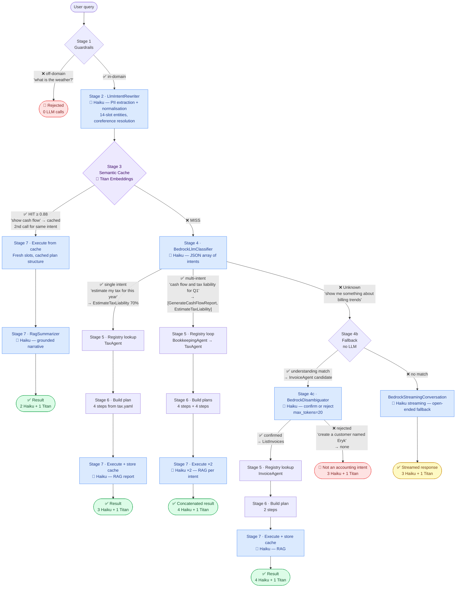

```mermaid
flowchart TD
    Q([User query]) --> S1{Stage 1<br/>Guardrails}

    S1 -- "❌ off-domain<br/>'what is the weather?'" --> REJECT1([🚫 Rejected<br/>0 LLM calls])

    S1 -- "✅ in-domain" --> S2["Stage 2 · LlmIntentRewriter<br/>🤖 Haiku — PII extraction + normalisation<br/>14-slot entities, coreference resolution"]

    S2 --> S3{Stage 3<br/>Semantic Cache<br/>🔢 Titan Embeddings}

    S3 -- "✅ HIT ≥ 0.88<br/>'show cash flow' → cached<br/>2nd call for same intent" --> S7_CACHED["Stage 7 · Execute from cache<br/>Fresh slots, cached plan structure"]
    S7_CACHED --> RAG_HIT["Stage 7 · RagSummarizer<br/>🤖 Haiku — grounded narrative"]
    RAG_HIT --> OUT_HIT([✅ Result<br/>2 Haiku + 1 Titan])

    S3 -- "❌ MISS" --> S4["Stage 4 · BedrockLlmClassifier<br/>🤖 Haiku — JSON array of intents"]

    S4 -- "✅ single intent<br/>'estimate my tax for this year'<br/>→ EstimateTaxLiability 70%" --> S5_S["Stage 5 · Registry lookup<br/>TaxAgent"]
    S5_S --> S6_S["Stage 6 · Build plan<br/>4 steps from tax.yaml"]
    S6_S --> S7_S["Stage 7 · Execute + store cache<br/>🤖 Haiku — RAG report"]
    S7_S --> OUT_S([✅ Result<br/>3 Haiku + 1 Titan])

    S4 -- "✅ multi-intent<br/>'cash flow and tax liability for Q1'<br/>→ [GenerateCashFlowReport, EstimateTaxLiability]" --> S5_M["Stage 5 · Registry loop<br/>BookkeepingAgent → TaxAgent"]
    S5_M --> S6_M["Stage 6 · Build plans<br/>4 steps + 4 steps"]
    S6_M --> S7_M["Stage 7 · Execute ×2<br/>🤖 Haiku ×2 — RAG per intent"]
    S7_M --> OUT_M([✅ Concatenated result<br/>4 Haiku + 1 Titan])

    S4 -- "❌ Unknown<br/>'show me something about billing trends'" --> S4B{Stage 4b<br/>Fallback<br/>no LLM}

    S4B -- "✅ understanding match<br/>→ InvoiceAgent candidate" --> S4C["Stage 4c · BedrockDisambiguator<br/>🤖 Haiku — confirm or reject<br/>max_tokens=20"]

    S4C -- "✅ confirmed<br/>→ ListInvoices" --> S5_D["Stage 5 · Registry lookup<br/>InvoiceAgent"]
    S5_D --> S6_D["Stage 6 · Build plan<br/>2 steps"]
    S6_D --> S7_D["Stage 7 · Execute + store cache<br/>🤖 Haiku — RAG"]
    S7_D --> OUT_D([✅ Result<br/>4 Haiku + 1 Titan])

    S4C -- "❌ rejected<br/>'create a customer named Eryk'<br/>→ none" --> REJECT2([🚫 Not an accounting intent<br/>3 Haiku + 1 Titan])

    S4B -- "❌ no match" --> STREAM["BedrockStreamingConversation<br/>🤖 Haiku streaming — open-ended fallback"]
    STREAM --> OUT_STREAM([✅ Streamed response<br/>3 Haiku + 1 Titan])

    style REJECT1 fill:#fee2e2,stroke:#ef4444,color:#7f1d1d
    style REJECT2 fill:#fee2e2,stroke:#ef4444,color:#7f1d1d
    style OUT_HIT  fill:#dcfce7,stroke:#16a34a,color:#14532d
    style OUT_S    fill:#dcfce7,stroke:#16a34a,color:#14532d
    style OUT_M    fill:#dcfce7,stroke:#16a34a,color:#14532d
    style OUT_D    fill:#dcfce7,stroke:#16a34a,color:#14532d
    style OUT_STREAM fill:#fef9c3,stroke:#ca8a04,color:#713f12
    style S2  fill:#dbeafe,stroke:#3b82f6,color:#1e3a8a
    style S4  fill:#dbeafe,stroke:#3b82f6,color:#1e3a8a
    style S4C fill:#dbeafe,stroke:#3b82f6,color:#1e3a8a
    style S7_CACHED fill:#dbeafe,stroke:#3b82f6,color:#1e3a8a
    style RAG_HIT fill:#dbeafe,stroke:#3b82f6,color:#1e3a8a
    style S7_S fill:#dbeafe,stroke:#3b82f6,color:#1e3a8a
    style S7_M fill:#dbeafe,stroke:#3b82f6,color:#1e3a8a
    style S7_D fill:#dbeafe,stroke:#3b82f6,color:#1e3a8a
    style STREAM fill:#dbeafe,stroke:#3b82f6,color:#1e3a8a
    style S3  fill:#ede9fe,stroke:#7c3aed,color:#3b0764
```